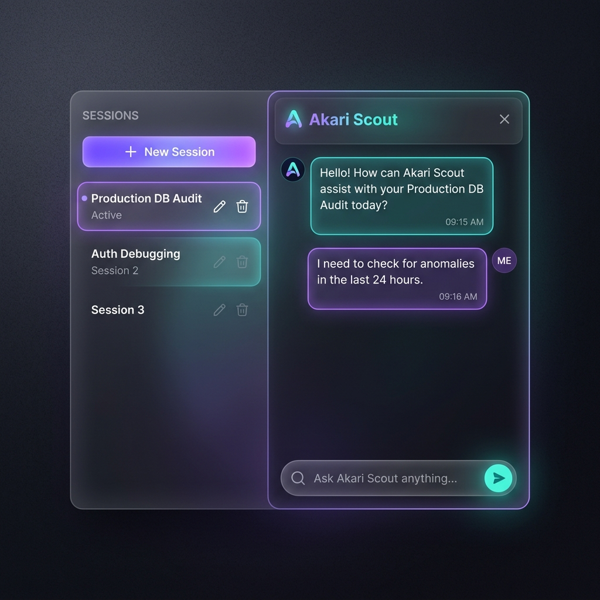

# ⚽ Akari Scout

AI-powered football scouting agent that helps clubs discover hidden gems through data-driven player analysis. Built by football and AI experts in Belgium.



## What It Does

Akari Scout is a conversational AI agent that acts as your personal data scout. Ask it to find players, compare profiles, or analyze markets — it queries the AKARI database, cross-references Transfermarkt and WyScout, and delivers structured scouting reports.

**Key capabilities:**
- 🔍 **Player Discovery** — Search by position, age, nationality, league, market value, and AKARI performance scores
- 📊 **Player Analysis** — Deep dives, head-to-head comparisons, and market monitoring
- ✅ **Transfermarkt Verification** — Automatic injury, transfer, and market value checks for every recommendation
- 🧠 **Intelligent Routing** — A fast classifier selects the optimal model per request (Haiku for simple queries, Opus for complex scouting workflows)
- 💬 **Session Management** — Multi-tenant chat sessions with persistent history

## Architecture

```
POST /chat  →  Router (Haiku)  →  Skills Loader  →  Agent Loop  →  Session Store
                  │                     │                │
           Selects model         Assembles system    Tool-use cycle
           + skills              prompt from .md     (max 15 iterations)
                                      files               │
                                                    ┌─────┴──────┐
                                                    │  9 Tools   │
                                                    │  AKARI DB  │
                                                    │  TMarkt    │
                                                    │  WyScout   │
                                                    └────────────┘
```

## Tech Stack

| Component | Technology |
|:---|:---|
| Runtime | Python 3.10+ |
| API | FastAPI + Uvicorn |
| LLM | Anthropic Claude (Haiku / Sonnet / Opus) |
| Data | Pandas + Parquet (AKARI Algorithm) |
| External | Transfermarkt (scraping), WyScout API v3 |

## Quick Start

```bash
# Install dependencies
pip install -r requirements.txt

# Configure environment
cp .env.example .env
# Edit .env — at minimum set ANTHROPIC_API_KEY

# Start the server
uvicorn app.main:app --reload --port 8000
```

- **Swagger docs**: http://localhost:8000/docs
- **Health check**: http://localhost:8000/status

## Project Structure

```
akari-ai-agent/
├── README.md                 ← You are here
├── requirements.txt          Python dependencies
├── .env.example              Environment variable template
├── skills/
│   ├── scout-core.md         Base persona & guardrails (always loaded)
│   ├── scout-search.md       Player search workflow
│   └── scout-analysis.md     Player analysis & market intelligence
├── data/                     Parquet data files
├── resources/
│   ├── setup.md              Detailed API specification
│   └── akari_session_ui.png  UI mockup
└── app/
    ├── main.py               FastAPI app & routes
    ├── config.py             Settings (from .env)
    ├── models.py             Pydantic models
    ├── router.py             Request classifier
    ├── agent.py              Tool-use agent loop
    ├── skills.py             Skill loader
    ├── session_store.py      Session store (swappable backend)
    └── tools/
        ├── registry.py       Tool registry & dispatch
        ├── akari_search.py   AKARI DB tools (7 tools)
        ├── transfermarkt.py  Transfermarkt scraper
        └── wyscout.py        WyScout API client
```

## Configuration

| Variable | Required | Default | Description |
|:---|:---|:---|:---|
| `ANTHROPIC_API_KEY` | ✅ | — | Anthropic API key |
| `DEFAULT_MODEL` | — | `claude-opus-4-0` | Model for complex queries |
| `ROUTER_MODEL` | — | `claude-haiku-4-0` | Model for request classification |
| `DATA_DIR` | — | `./data` | Path to parquet data files |
| `API_KEY` | — | — | Optional API key protection |
| `WYSCOUT_USERNAME` | — | — | WyScout API credentials |
| `WYSCOUT_PASSWORD` | — | — | WyScout API credentials |

## API Overview

| Endpoint | Method | Description |
|:---|:---|:---|
| `/status` | GET | Health check |
| `/sessions` | GET | List sessions for a tenant |
| `/sessions/{id}` | GET | Get session with messages |
| `/sessions` | PUT | Create a new session |
| `/sessions/{id}` | PATCH | Update session label |
| `/sessions/{id}` | DELETE | Delete a session |
| `/chat` | POST | Chat with the AI agent |

> Full API specification with request/response schemas: [resources/setup.md](resources/setup.md)

## Tools (9 registered)

| Tool | Source | Description |
|:---|:---|:---|
| `search_players` | AKARI DB | Multi-filter player search |
| `get_player_profile` | AKARI DB | Full player profile by ID |
| `get_similar_players` | AKARI DB | Similarity algorithm |
| `get_competitions` | AKARI DB | List available competitions |
| `get_stat_leaders` | AKARI DB | Top players by metric |
| `list_discoverable_fields` | AKARI DB | Parameter discovery |
| `discover_values` | AKARI DB | Valid values for filters |
| `check_transfermarkt` | Transfermarkt | Injuries, transfers, market value |
| `check_wyscout` | WyScout | Career stats, contract info |

## License

Proprietary — Akari Analytics © 2026
